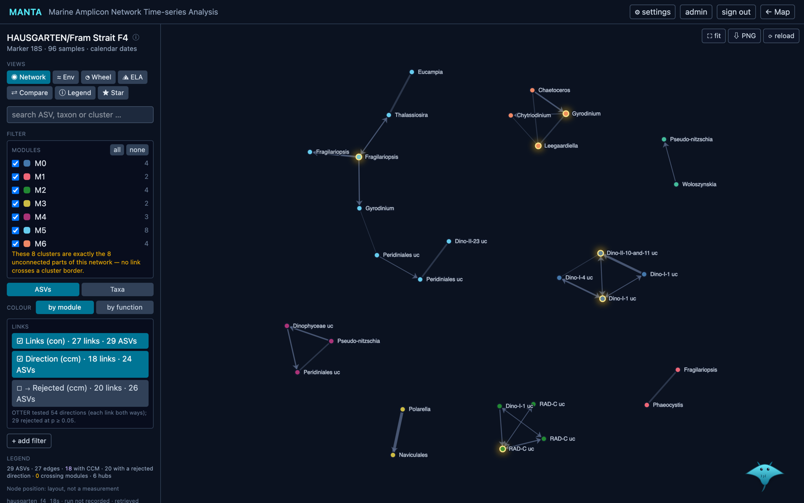
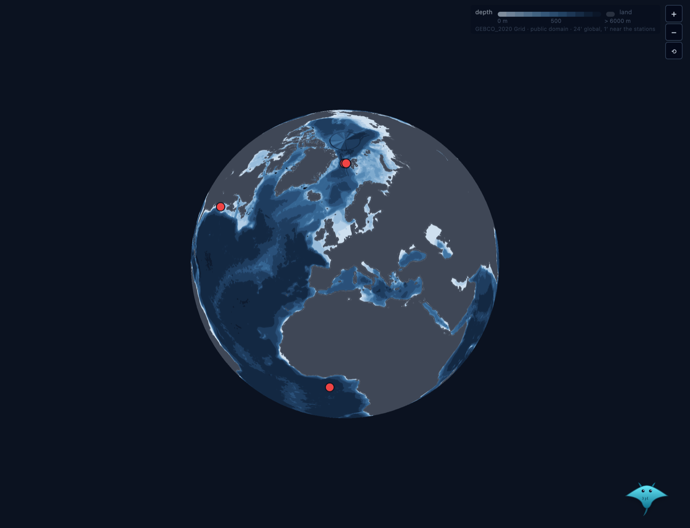
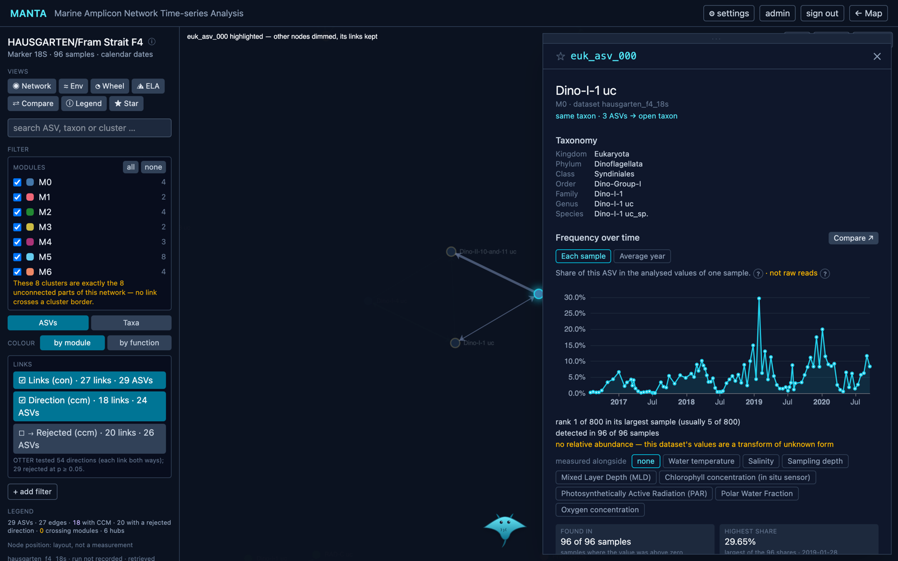
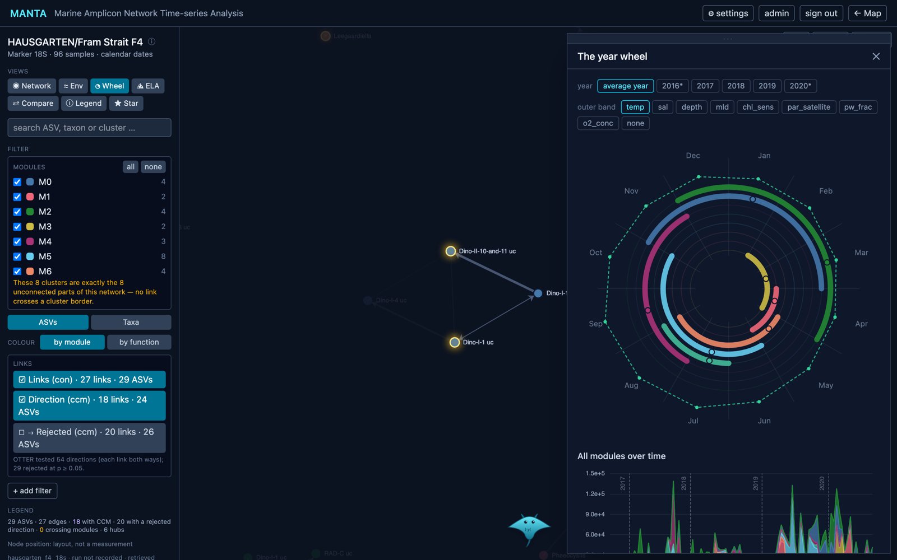
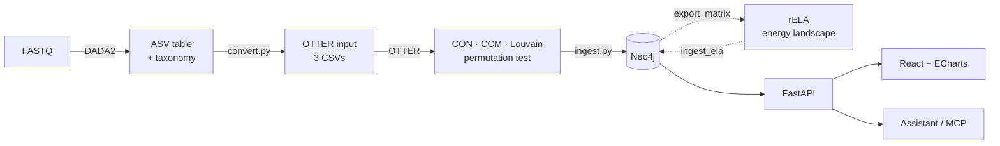

<div align="center">


# MANTA

**M**arine **A**mplicon **N**etwork **T**ime-series **A**nalysis

Explore Marine Amplicon Time-series locally in your browser.

<p>
  
  
  
  
  
  <a href="LICENSE"></a>
  <a href="https://docs.docker.com/compose/"></a>
</p>

[Features](#features) ·
[Workflow](#workflow) ·
[Installation](#installation) ·
[Importing data](#importing-data) ·
[When something breaks](#when-something-breaks) ·
[Sources and licenses](#sources-and-licenses)

<br>



</div>

<br>

MANTA is a web platform for marine amplicon time series. Sequencing data run through a fixed
analysis chain: **DADA2 → OTTER → Neo4j**. They become searchable, visual and reproducible in your
browser via a world map, networks, modules, and ASV-detailpages.

MANTA does **not** reimplement methods. it uses them and connects their results. Every
number on screen comes from a stored run, and a built-in assistant answers questions with typed
tools that look values up in the graph instead of making them up.

## Features

<table>
<tr>
<td width="50%" valign="top">

**World map with bathymetry.** Datasets as points on a globe, water depth from GEBCO in twelve
bands.



</td>
<td width="50%" valign="top">

**ASV page.** Taxonomy, abundance over time, seasonality, neighbours, Fourier spectrum and the
environment measured alongside.



</td>
</tr>
<tr>
<td width="50%" valign="top">

**Year wheel.** When each module sits above its own annual mean, one environmental variable as the
outer band, and all modules stacked over all samples below.



</td>
<td width="50%" valign="top">

**And more**

- **Networks** of co-occurrence (CON) and directed predictive skill (CCM), Louvain modules, hubs
  by an adjustable μ + k·σ criterion
- **Freely combinable layers:** links, kept and rejected CCM directions
- **Filters** by module, taxon, function (literature annotation), hub, size and strength —
  the state lives in the URL
- **Taxon view:** ASVs of identical taxonomy collapse into one expandable point
- **Energy landscape** (rELA): stable community states and their transitions
- **Comparison, environment, per-account stars**
- **Browser import** from FASTQ, DADA2 output or a finished OTTER run
- **Assistant** with typed tools, also usable as an MCP server

</td>
</tr>
</table>

The screenshots show the example dataset that ships with OTTER (HAUSGARTEN F4, see
[Sources and licenses](#sources-and-licenses)); it is not part of this repository.

## Workflow



| Tool | Role | Integration |
|---|---|---|
| [**DADA2**](https://benjjneb.github.io/dada2/) (R) | FASTQ → ASVs and taxonomy | subprocess |
| [**OTTER**](https://gitlab.com/qtb-hhu/marine/otter) (Python) | co-occurrence and CCM networks, Louvain modules | subprocess |
| [**rELA**](https://github.com/kecosz/rELA) (R) | energy landscape on presence/absence | downloaded from GitHub, pinned |
| [**Neo4j**](https://neo4j.com/) | storage, separated per dataset and run | graph database |
| [**FastAPI**](https://fastapi.tiangolo.com/) · [**React**](https://react.dev/) · [**ECharts**](https://echarts.apache.org/) · [**MapLibre**](https://maplibre.org/) | API and interface | installed by pip / npm |

## Installation

### Step 1 — Run MANTA

Requirements:

- [Docker](https://docs.docker.com/get-started/get-docker/) with Compose
- [Git](https://git-scm.com/downloads)
- Windows: virtualisation enabled in the BIOS/UEFI and WSL 2 (`wsl --install`)

```bash
git clone https://github.com/benblumbach-eng/manta.git
cd manta/deploy
cp .env.example .env
```

Set `NEO4J_PASSWORD` in `deploy/.env` **now**: Neo4j takes it on its very first start and keeps
it in the database from then on — editing the file later changes nothing. Then:

```bash
docker compose up -d --build
docker compose exec api python manage.py adduser alice --role admin
```

MANTA is now running on <http://localhost:8080>. Sign in with the account you just created.

It binds to this machine only. The stack occupies `8080` and `8443` (interface), `7474` and
`7687` (Neo4j) and `11434` (assistant) — if one of them is taken, for instance by a Neo4j Desktop
already running, `docker compose up` fails with a bind error; the ports are settable in
`deploy/.env`.

> [!NOTE]
> Step 1 shows datasets but cannot import them. For your own data, continue with step 2.

For the assistant, once: `docker compose exec ollama ollama pull qwen2.5:7b`

### Step 2 — Import your own data

Requirements:

- Everything from step 1
- [uv](https://docs.astral.sh/uv/getting-started/installation/) and [Node.js](https://nodejs.org/) 22+
- `curl` and `unzip` (the last step downloads the annotation sources)
- Raw FASTQ only: [R](https://cloud.r-project.org/) 4.4+, cutadapt, DADA2
- Energy landscape only: R 4.4+

<details>
<summary><b>On Windows? Do this first — then the commands below work unchanged.</b></summary>

<br>

Step 2 needs Linux. Windows has it built in. In **PowerShell**, once:

```powershell
wsl --install
```

Restart, then open **Ubuntu** from the start menu. The prompt reads `you@machine:~$` — everything
from here on happens in that window, never in PowerShell. Install the tools and get MANTA:

```bash
sudo apt update && sudo apt install -y curl git unzip
curl -LsSf https://astral.sh/uv/install.sh | sh
curl -fsSL https://deb.nodesource.com/setup_22.x | sudo -E bash - && sudo apt install -y nodejs
export PATH="$HOME/.local/bin:$PATH"
git clone https://github.com/benblumbach-eng/manta.git ~/manta
```

Three things worth knowing, because each one fails in a way that looks like your mistake:

- uv and Node.js have to be installed **inside** Ubuntu. A Windows installation is invisible there.
- `export PATH=…` makes uv usable in the shell that is already open; new shells read it from
  `~/.bashrc`. Without it, `uv: command not found` right after installing uv.
- The clone must live in the Linux file system (`~/manta`), **not** under `C:\` or `/mnt/c`.
  OTTER contains a file called `lutra/con.py`, and `CON` is a reserved device name on Windows, so
  `git submodule update --init` fails there with `invalid path 'lutra/con.py'`.

</details>

<br>

Run it from the repository root — `~/manta` below; use your own path if you cloned elsewhere.
Every line ends in `&&`, so the block stops at the first failure instead of running the rest in
the wrong place. Never with `sudo`: that makes `node_modules` root-owned, and npm then refuses
to write into it.

```bash
cd ~/manta &&
git submodule update --init &&
uv venv --python 3.12 apps/manta_web/backend/.venv &&
uv pip install -p apps/manta_web/backend/.venv/bin/python -r apps/manta_web/backend/requirements.txt &&
cp .env.example apps/manta_web/backend/.env &&
(cd apps/manta_web/frontend && npm install) &&
uv venv --python 3.10 tools/neo4j_ingest/.venv &&
uv pip install -p tools/neo4j_ingest/.venv/bin/python -r tools/neo4j_ingest/requirements.txt &&
uv venv --python 3.14 tools/dada2_to_otter/.venv &&
uv pip install -p tools/dada2_to_otter/.venv/bin/python -r tools/dada2_to_otter/requirements.txt &&
uv venv --python 3.10 submodules/otter/.venv &&
uv pip install -p submodules/otter/.venv/bin/python -r tools/otter_runner/requirements-otter.txt
```

Optional, for the literature annotation — it downloads sources from third parties, so it can fail
for reasons that have nothing to do with your installation. Importing works without it:

```bash
cd ~/manta && bash tools/traits/fetch_sources.sh
```

Now put the `NEO4J_PASSWORD` from step 1 into `apps/manta_web/backend/.env`, then:

The copy comes after the password, not before — otherwise the ingest tool keeps the template and
the import fails at authentication. This block, too, returns to the repository root first, so it
works from wherever you edited the file:

```bash
cd ~/manta &&
cp apps/manta_web/backend/.env tools/neo4j_ingest/.env &&
bash apps/manta_web/dev.sh start
```

The interface is now running on <http://localhost:5173> — import under **Import a dataset**,
with the example datasets in [`examples/`](examples/).

The account from step 1 does not work here. It lives in the container's database, and step 2 has
its own next to the backend, so give yourself one:

```bash
cd ~/manta/apps/manta_web/backend &&
set -a && . ./.env && set +a &&
.venv/bin/python manage.py adduser alice --role admin
```

Both addresses read the same graph: what you import on :5173 appears on :8080 as well. Only the
import needs :5173, because the analysis chain runs on your machine, not in the container.

To bring in a newer version later:

```bash
cd ~/manta &&
git pull &&
git submodule update --init &&
uv pip install -p apps/manta_web/backend/.venv/bin/python -r apps/manta_web/backend/requirements.txt &&
(cd apps/manta_web/frontend && npm install) &&
bash apps/manta_web/dev.sh stop &&
bash apps/manta_web/dev.sh start
```

The two install steps are there because a new version may bring new dependencies; both do nothing
when nothing changed. If step 1 runs as well, `cd ~/manta/deploy && docker compose up -d --build`
rebuilds it.

To start and stop it again later, from the repository root:

```bash
cd ~/manta
bash apps/manta_web/dev.sh start    # database, backend and interface
bash apps/manta_web/dev.sh stop     # backend and interface; the database keeps running
bash apps/manta_web/dev.sh stop --db  # the database as well
bash apps/manta_web/dev.sh status   # what is running
bash apps/manta_web/dev.sh logs     # the last lines of both logs
```

For raw FASTQ:

```bash
uv tool install cutadapt
Rscript -e 'install.packages("BiocManager", repos = "https://cloud.r-project.org"); BiocManager::install(c("dada2", "Biostrings", "ShortRead"))'
```

For the energy landscape:

```bash
cd ~/manta &&
bash tools/ela/fetch_rela.sh &&
Rscript tools/ela/setup_r.R
```

> [!NOTE]
> Taxonomic names need a [PR2 file](https://github.com/pr2database/pr2database/releases) in DADA2
> format, passed as `MANTA_PR2=<file>`; without it the ASVs stay `unassigned`. On macOS, run
> `xcode-select --install` if an R package fails to compile.

## Importing data

MANTA starts empty. There are three entry points, depending on how far the data are already
processed.

| Entry point | Input | What MANTA computes |
|---|---|---|
| **1 · FASTQ** | raw reads | DADA2 → OTTER → graph |
| **2 · DADA2 output** | `.Rdata`, or `abundance.csv`, `taxa_info.csv`, `environment_info.csv` (`;`-separated) | OTTER → graph |
| **3 · OTTER result** | the three network tables + `abundance.csv`, `environment_info.csv`, and the run's `manta_manifest.json` — without it the tables have to carry their default names | graph only |

DADA2 runs for minutes to hours and needs a lot of memory. On an 8 GB machine, compute by hand
first and load afterwards.

**To try it out, the repository ships two datasets** in [`examples/`](examples/) — synthetic,
generated for MANTA:

| Folder | Samples | Use |
|---|---|---|
| `examples/synthetic_12_samples` | 12 | a first import, a few minutes |
| `examples/synthetic_96_samples` | 96 | a network worth looking at, considerably longer |

Each holds the five files of entry point 2 — the abundance matrix, the taxonomy and the read
tracking as `.Rdata`, the ASV sequences as FASTA, and a `.csv` with `sample` and `date`. Select
all five under **DADA2 output**. The file names do not matter: MANTA recognises them by content,
so your own DADA2 output works whatever its files are called.
On Windows the browser runs outside WSL, so reach them at
`\\wsl.localhost\Ubuntu\home\<you>\manta\examples\`.

<details>
<summary><b>On the command line</b> — the same three entry points by hand</summary>

<br>

```bash
cd ~/manta   # everything below runs from the repository root

# 1 — FASTQ → OTTER input
Rscript tools/dada2_to_otter/run_dada2.R  <fastq_dir> <out_dir>
tools/dada2_to_otter/.venv/bin/python tools/dada2_to_otter/convert.py --in <out_dir> --out <csv_dir>

# 2 — run OTTER (skip for entry point 3)
submodules/otter/.venv/bin/python tools/otter_runner/run_otter.py \
  --otter-root submodules/otter --abundance <csv_dir>/abundance.csv \
  --taxa <csv_dir>/taxa_info.csv --environment <csv_dir>/environment_info.csv \
  --out <otter_out>

# 3 — load into the graph
set -a; . tools/neo4j_ingest/.env; set +a
GOLDEN_DIR=<otter_out> OTTER_TESTS=<csv_dir> \
  tools/neo4j_ingest/.venv/bin/python tools/neo4j_ingest/ingest.py \
  --dataset-id <name> --marker 18S --region "..." --time-axis dates
```

**Energy landscape** for a loaded dataset:

```bash
cd ~/manta
set -a; . tools/neo4j_ingest/.env; set +a
tools/neo4j_ingest/.venv/bin/python tools/ela/export_matrix.py <dataset_id>
Rscript tools/ela/run_ela.R tools/ela/out/<ds>.input.json tools/ela/out/<ds>.result.json
tools/neo4j_ingest/.venv/bin/python tools/ela/ingest_ela.py tools/ela/out/<ds>.result.json
```

**Literature annotation** for a loaded dataset — this is what the **function** filter shows:

```bash
cd ~/manta
set -a; . tools/neo4j_ingest/.env; set +a
tools/neo4j_ingest/.venv/bin/python tools/traits/annotate.py <dataset_id>
```

It needs the sources fetched by `tools/traits/fetch_sources.sh`. Nothing is computed from your
data: each ASV's lineage name is looked up in three pinned sources, so the result is a property
of the **name**, never a finding of this dataset — and every answer says so.

**Network as an image** (PNG, PDF, GraphML for Cytoscape or Gephi):

```bash
cd ~/manta
submodules/otter/.venv/bin/python tools/otter_figures/render_network.py --in <otter_out> --out <images>
```

</details>

### OTTER as a submodule

OTTER is never imported as a library, only started as a subprocess. The multi-core path makes the
edge order non-deterministic, and Louvain turns that into real differences in values, so every
call runs with `num_cores=1` — `tools/otter_runner/run_otter.py` sets it directly, which is why
importing needs no change to the submodule at all.

OTTER's own two network tests do the same thing through a patch kept in this repository
([`tools/otter_runner/otter-determinism.patch`](tools/otter_runner/otter-determinism.patch))
rather than as a commit in the submodule. Applying it is only of interest for running those
tests; the import does not touch them.

## When something breaks

Every entry below happened during a real first installation, on Windows and in WSL. The message
is the key — search this table for the text you see.

| Message | Cause | What to do |
|---|---|---|
| `invalid path 'lutra/con.py'` | OTTER holds a file named `con.py`, and `CON` is a reserved device name on Windows. Also hits a clone under `/mnt/c`. | Clone into the Linux file system: `~/manta` |
| `Das Token "&&" ist … kein gültiges Anweisungstrennzeichen` | The commands are running in PowerShell | Use the Ubuntu shell of WSL 2 |
| `uv: command not found` right after installing uv | New `PATH` not in the open shell — or uv was installed on Windows, not inside WSL | `export PATH="$HOME/.local/bin:$PATH"`, or install inside Ubuntu |
| `detected dubious ownership in repository` | The clone lies on the Windows disk and belongs to the Windows user | Clone into `~/manta` instead |
| `EACCES: permission denied, mkdir … node_modules` | `npm install` was run with `sudo` once; the directory now belongs to root | `sudo chown -R $USER:$USER ~/manta` and never use sudo with npm |
| A chain of `No such file or directory` for `tools/…` | One step failed and the block kept running from the wrong directory | Start again from the repository root; the blocks above stop at the first failure |
| `Failed to fetch` in the browser | The interface cannot reach the backend | `bash apps/manta_web/dev.sh status` — it says whether the backend is off or cannot reach the database |
| `neo4j unreachable: … Security.Unauthorized` | The database holds a different password than your `.env`. Neo4j takes `NEO4J_AUTH` **only on its very first start**; later edits to `deploy/.env` change nothing | With an empty database the shortest way is to recreate it: `docker compose down`, `docker volume rm deploy_neo4j_data`, `docker compose up -d` |
| `… Security.AuthenticationRateLimit` | Too many failed logins in a row — the health check retries once per second | Restart the Neo4j container, then test the password exactly once |
| `permission denied … /var/run/docker.sock` | Your Linux user is not in the `docker` group | `sudo usermod -aG docker $USER`, then open a new shell |
| The account from step 1 is rejected on `:5173` | Two separate account databases: the container has its own, step 2 has its own | Create one for step 2 — see the `adduser` command in step 2 |
| Import says `missing: abundance.csv, …` although you picked the five files | Browser downloads are named `… (1).Rdata`; the names have to match exactly | Pick the files from the clone, not from the download folder |

## Project structure

```
apps/manta_web/      FastAPI backend and React interface
apps/manta_mcp/      assistant tools, also as an MCP server
tools/              converter, ingest, OTTER runner, energy landscape, bathymetry, functions
deploy/             Docker Compose, Caddy, backup
examples/           two synthetic datasets for a first import
submodules/otter/   OTTER (third-party, changed only by patch)
docs/images/        images for this README
```

## Sources and licenses

MANTA's own code is released under the [MIT License](LICENSE). Everything below belongs to its
authors and keeps its own license. Where a source has no license that allows redistribution,
MANTA **links** to it or downloads it from its original location — it is not copied into this
repository.

**Software MANTA calls**

- **OTTER** — QTB, Heinrich Heine University Düsseldorf, MIT License. Included as a Git submodule,
  unchanged apart from the patch above. <https://gitlab.com/qtb-hhu/marine/otter>
- **DADA2** — Callahan et al. 2016, Nat Methods 13:581, [doi:10.1038/nmeth.3869](https://doi.org/10.1038/nmeth.3869).
  Installed from Bioconductor. `tools/dada2_to_otter/run_dada2.R` is MANTA's own script along the
  [DADA2 tutorial](https://benjjneb.github.io/dada2/tutorial.html); its default filter and primer
  parameters follow the pipeline script published by QTB in
  [fastq2abundance](https://gitlab.com/qtb-hhu/marine/publications/fastq2abundance) (Ellen Oldenburg).
  That script has no license and is therefore only linked, not included.
- **rELA** — Suzuki, Nakaoka, Fukuda, Masuya 2021, Ecological Monographs 91(3):e01469.
  Downloaded by `tools/ela/fetch_rela.sh` from <https://github.com/kecosz/rELA>.
- **cutadapt** — Martin 2011, EMBnet.journal 17:10, [doi:10.14806/ej.17.1.200](https://doi.org/10.14806/ej.17.1.200).
- **Neo4j**, **FastAPI**, **React**, **Apache ECharts**, **MapLibre GL JS** and all other packages
  listed in `requirements.txt` and `package.json` — installed from PyPI and npm under their own
  licenses.
- **Qwen 2.5** language models — Alibaba Cloud; license per model size as stated in step 1.

**Data**

- **Bathymetry and coastline** (`apps/manta_web/frontend/public/bathymetry.json`) — derived by
  `tools/bathymetry/make_bathymetry.py` from the [GEBCO_2020 Grid](https://www.gebco.net/), public domain.
- **Function annotation tables** — downloaded by `tools/traits/fetch_sources.sh` from their original
  locations and checked against `tools/traits/vendor/SHA256SUMS`:
  Mixoplankton Database via [PR2](https://github.com/pr2database/pr2database) v5.1.0
  (Mitra et al. 2023, [doi:10.1111/jeu.12972](https://doi.org/10.1111/jeu.12972));
  Trophic Mode Database v1.1 (Jones, Rynearson, Menden-Deuer 2025, [doi:10.5281/zenodo.15149453](https://doi.org/10.5281/zenodo.15149453), CC BY 4.0);
  FAPROTAX 1.2.12 (Louca et al. 2016, [doi:10.1126/science.aaf4507](https://doi.org/10.1126/science.aaf4507)).
- **PR2 reference database** for taxonomy — Guillou et al. 2013, Nucleic Acids Res 41:D597,
  [doi:10.1093/nar/gks1160](https://doi.org/10.1093/nar/gks1160); downloaded by the user, not included.
- **Screenshots** — the HAUSGARTEN F4 example dataset from OTTER's test data;
  Oldenburg et al. 2024, *Beyond blooms*, Commun Earth Environ 5:643,
  [doi:10.1038/s43247-024-01782-0](https://doi.org/10.1038/s43247-024-01782-0).
- **Example datasets** in `examples/` — synthetic, generated for MANTA; MIT License like the code.

**Methods**

- **Network terminology** — Oldenburg et al. 2024 (above).
- **Keystone criteria** — Priest et al. 2025, Nat Commun 16:1326. [doi:10.1038/s41467-025-56203-3](https://doi.org/10.1038/s41467-025-56203-3)

<br>

<div align="center">
<sub>Bachelor's thesis · Quantitative and Theoretical Biology · Heinrich Heine University Düsseldorf</sub>
</div>
